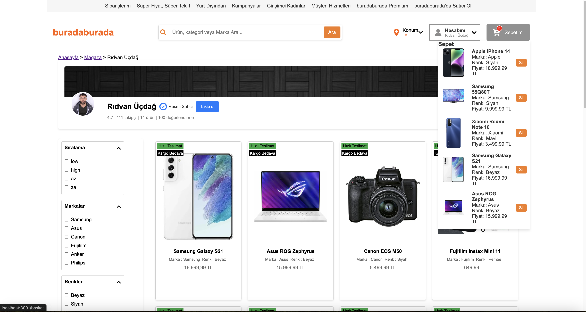
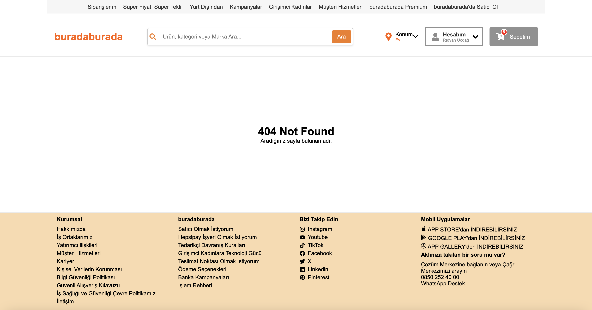

Hafta sonu, cumartesi ve pazar günü, boş vaktimde bilgilerimi tazelemek için Hepsiburada'nın arama kısmını klonlamaya çalıştım. Ancak, bu süreçte responsive kodlama yapma fırsatım olmadı, bu yüzden proje responsive değil. Bu projede ReactJS, Redux ve TypeScript kullandım.

Netlify : https://hepsiburada-search.netlify.app/

